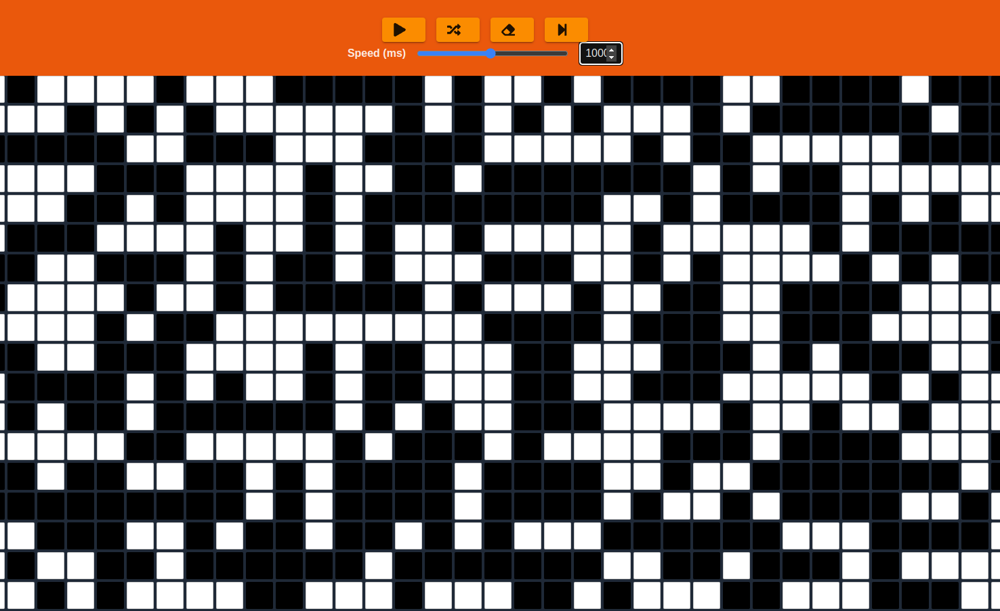

# Rusty's Game of Life

Conway's Game of Life with the simulation core written in Rust and rendered through a React/WebAssembly frontend.



## About

Rusty's Game of Life was a learning project for building a fast simulation engine in Rust, compiling it to WebAssembly, and controlling it from a browser UI. The project also includes command-line support for testing and debugging the core automata logic.

## Tech Stack

- Rust
- WebAssembly
- wasm-pack
- React
- TypeScript
- Vite
- Material UI

## Features

- Rust implementation of Conway's Game of Life rules.
- WebAssembly package consumed by the React frontend.
- Interactive grid editing in the browser.
- Playback controls for stepping and running generations.
- CLI-oriented Rust entry point for local simulation work.
- Rust tests for board, input, and game behavior.

## My Role

I built the Rust simulation core, browser integration, React control surface, and tests while using the project to practice Rust, WebAssembly, and test-driven development.

## Running Locally

Install Rust, Cargo, Node.js, and `wasm-pack`, then run:

```bash
git clone https://github.com/mattcattb/RustysGameofLife.git
cd RustysGameofLife/react-frontend
npm install
npm start
```

Run the Rust tests directly:

```bash
cd GOL-core-rust
cargo test
```

## Project Notes

The repo is split into `GOL-core-rust` for the simulation library and `react-frontend` for the browser UI. The interesting part of the project is the boundary between Rust-owned state updates and the React controls that visualize and mutate the board.
